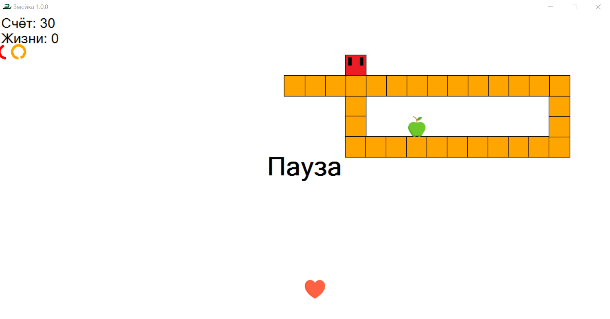
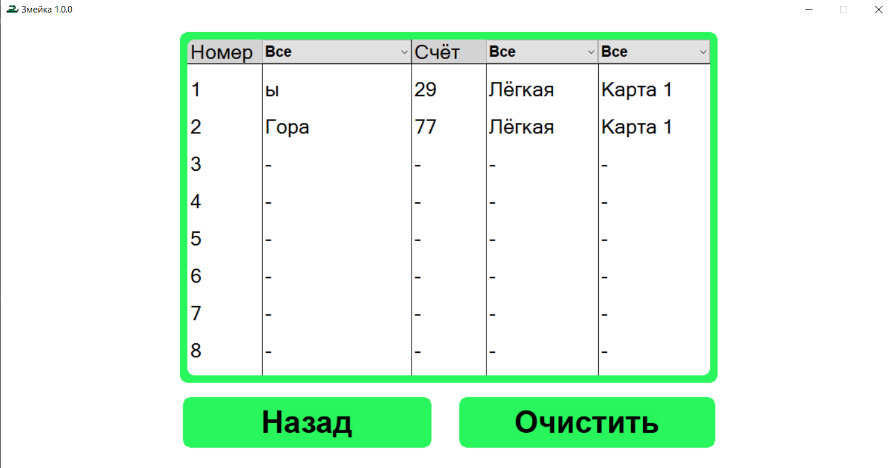
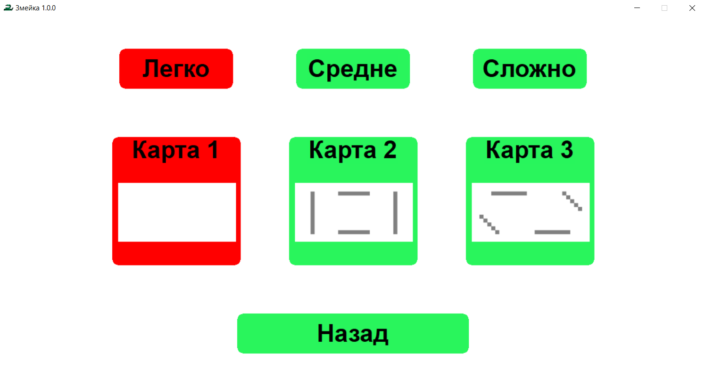

# Snake Game

My own implementation of the classic snake game with C++ and WinAPI.

## How to play

To get score player should eat apples. If snake eats apple, it grows and player gets 1 point. If snake eats itself 
or bumps into the wall, game is over.

Controls:
- **Arrow keys** - specify direction of snake's movement
- **Space** - pause/unpause game
- **Esc** - exit game
- **Shift** - accelerate/decelerate snake

On each eaten apple snake's speed is increased depending on selected difficulty.

Every 10 points **Extra Heart** is generated. Player has 3 seconds to take it. If snake takes it, it gets 1 extra life. 
This means if snake bump into an obstacle it won't die, but get 1 second of invulnerability (snake turns orange). Player 
could have up to 3 extra lives.

## Records

You can see your records in **Records** section of the game. You can change nickname displayed here from the input on main menu.
Records could be filtered by name, difficulty and map.

## Screenshots

### Gameplay:

### Records:

### Choosing of difficulty and map:

## How to build
1. Clone repository
2. Build it using CMake 3.23+ and C++ 20 compiler
3. Enjoy!